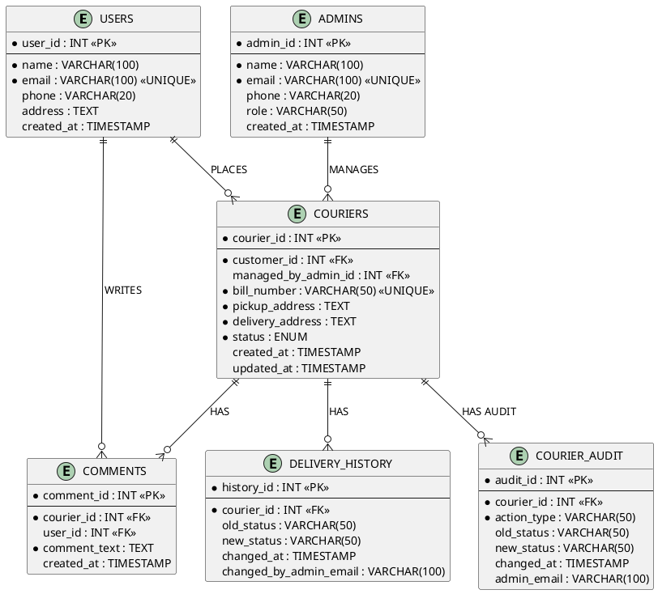

# ER Diagram Generation Instructions

## Option 1: Using dbdiagram.io (RECOMMENDED - Easiest)

1. Go to **https://dbdiagram.io/d**
2. Copy the entire content from `ER_DIAGRAM_CODE.dbml` file
3. Paste it in the left panel
4. The diagram will auto-generate on the right
5. Click **Export** → **PNG** or **PDF** to download

---

## Option 2: Using MySQL Workbench (Auto-Generate from Database)

1. Open **MySQL Workbench**
2. Connect to your database
3. Go to **Database** → **Reverse Engineer**
4. Select `courier_management` database
5. Click through the wizard
6. It will generate the ER diagram automatically
7. Export as PNG: **File** → **Export** → **Export as PNG**

---

## Option 3: Using Draw.io (Manual)

1. Go to **https://app.diagrams.net/**
2. Create New Diagram → **Entity Relation**
3. Manually create entities:

### Entities (Rectangles):
- **USERS**: user_id (PK), name, email, phone, address, created_at
- **ADMINS**: admin_id (PK), name, email, phone, role, created_at
- **COURIERS**: courier_id (PK), customer_id (FK), managed_by_admin_id (FK), bill_number, pickup_address, delivery_address, status, created_at, updated_at
- **DELIVERY_HISTORY**: history_id (PK), courier_id (FK), old_status, new_status, changed_at, changed_by_admin_email
- **COURIER_AUDIT**: audit_id (PK), courier_id (FK), action_type, old_status, new_status, changed_at, admin_email
- **COMMENTS**: comment_id (PK), courier_id (FK), user_id (FK), comment_text, created_at

### Relationships (Diamonds):
- USERS (1) ──PLACES──► (N) COURIERS
- ADMINS (1) ──MANAGES──► (N) COURIERS
- COURIERS (1) ──HAS──► (N) DELIVERY_HISTORY
- COURIERS (1) ──HAS──► (N) COURIER_AUDIT
- COURIERS (1) ──HAS──► (N) COMMENTS
- USERS (1) ──WRITES──► (N) COMMENTS

---

## Option 4: Using PlantUML Code

Create a file `er_diagram.puml` with this content:

Then use online PlantUML viewer or VS Code extension to render it.

---

## Quick Summary of Entities & Relationships:

**6 Entities:**
1. USERS (Customers)
2. ADMINS (Managers)
3. COURIERS (Main orders table)
4. DELIVERY_HISTORY (Status change log)
5. COURIER_AUDIT (Trigger-based audit trail)
6. COMMENTS (User feedback)

**6 Relationships:**
1. Users(1) → Places(N) → Couriers
2. Admins(1) → Manages(N) → Couriers
3. Couriers(1) → Has(N) → Delivery_History
4. Couriers(1) → Has(N) → Courier_Audit
5. Couriers(1) → Has(N) → Comments
6. Users(1) → Writes(N) → Comments

All relationships are ONE-TO-MANY (1:N)
